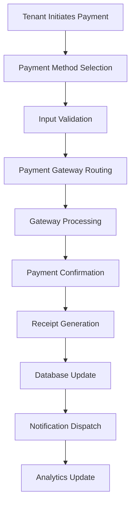

# Agently Landlord Platform - Product Requirements Document (PRD) & Functional Requirements Document (FRD)

## Document Information
- **Document Version**: 1.0.0
- **Last Updated**: October 15, 2025
- **Document Owner**: Agently Product Team
- **Target Release**: v2.0.0

---

# Table of Contents
1. [Vision Statement and Strategic Objectives](#1-vision-statement-and-strategic-objectives)
2. [Complete User Ecosystem](#2-complete-user-ecosystem)
3. [Technical Architecture Requirements](#3-technical-architecture-requirements)
4. [Detailed Screen Requirements](#4-detailed-screen-requirements)
5. [Data Model Requirements](#5-data-model-requirements)
6. [Cross-User Synchronization Requirements](#6-cross-user-synchronization-requirements)
7. [Payment Processing Requirements](#7-payment-processing-requirements)
8. [API Requirements](#8-api-requirements)
9. [AI & Smart Features Requirements](#9-ai--smart-features-requirements)
10. [Security & Compliance Requirements](#10-security--compliance-requirements)
11. [Performance & Scalability Targets](#11-performance--scalability-targets)
12. [Localization & Accessibility Requirements](#12-localization--accessibility-requirements)
13. [Testing & Deployment Requirements](#13-testing--deployment-requirements)
14. [Acceptance Criteria](#14-acceptance-criteria)
15. [Innovation Opportunities](#15-innovation-opportunities)

---

# 1. Vision Statement and Strategic Objectives

## Vision Statement
To revolutionize property management in Africa by creating the most comprehensive, AI-powered landlord platform that seamlessly connects all stakeholders in the rental ecosystem, maximizing efficiency, transparency, and profitability while ensuring exceptional tenant experiences.

## Strategic Objectives

### Primary Objectives
1. **Market Leadership**: Become the #1 property management platform in Nigeria and expand to 5 African countries within 3 years
2. **User Adoption**: Achieve 100,000+ active users across all stakeholder categories within 24 months
3. **Revenue Growth**: Generate $10M+ ARR through subscription tiers and value-added services
4. **Operational Excellence**: Maintain 99.9% uptime with sub-2-second response times

### Secondary Objectives
1. **Innovation**: Pioneer AI-driven property management solutions for emerging markets
2. **Financial Inclusion**: Enable property ownership and investment for middle-income Africans
3. **Sustainability**: Reduce environmental impact through optimized property operations
4. **Community Building**: Foster a thriving ecosystem of property professionals and investors

## Success Metrics
- **User Engagement**: 85% monthly active user rate
- **Customer Satisfaction**: 4.8/5.0 average rating across all user types
- **Operational Efficiency**: 60% reduction in manual property management tasks
- **Revenue Optimization**: 25% increase in rental collection rates for users
- **Market Penetration**: 40% market share in target Nigerian cities

---

# 2. Complete User Ecosystem

## 2.1 User Roles Overview

The Agently platform supports 8 distinct user roles, each with specialized capabilities and interfaces:

### 1. **Property Owner** 👑
- **Purpose**: Ultimate property owners who delegate management while maintaining oversight
- **Primary Goals**: Maximize ROI, minimize vacancies, ensure property appreciation
- **Key Features**: Portfolio oversight, financial reporting, manager assignment
- **Access Level**: Full system access with delegation capabilities

### 2. **Property Manager** 🏢
- **Purpose**: Professional property management companies or individuals
- **Primary Goals**: Efficient daily operations, tenant satisfaction, cost optimization
- **Key Features**: Multi-property management, tenant coordination, maintenance oversight
- **Access Level**: Operational access across assigned properties

### 3. **Tenant** 🏠
- **Purpose**: Rent-paying occupants of properties
- **Primary Goals**: Comfortable living, easy rent payment, quick issue resolution
- **Key Features**: Rent payment, maintenance requests, lease management
- **Access Level**: Limited to their unit and personal information

### 4. **Real Estate Agent/Realtor** 🏡
- **Purpose**: Licensed real estate professionals marketing and leasing properties
- **Primary Goals**: Generate leads, close deals, build client relationships
- **Key Features**: Property listings, lead management, commission tracking
- **Access Level**: Marketing and sales-focused access

### 5. **Maintenance Contractor** 🔧
- **Purpose**: Service providers handling property repairs and maintenance
- **Primary Goals**: Efficient job completion, accurate billing, client satisfaction
- **Key Features**: Work order management, scheduling, invoicing
- **Access Level**: Limited to assigned maintenance tasks

### 6. **Accountant** 💰
- **Purpose**: Financial professionals managing property accounting
- **Primary Goals**: Accurate financial reporting, tax compliance, cash flow optimization
- **Key Features**: Financial reporting, expense tracking, tax preparation
- **Access Level**: Financial data across assigned properties

### 7. **System Administrator** ⚙️
- **Purpose**: Platform administrators managing system configuration and users
- **Primary Goals**: System stability, user support, platform optimization
- **Key Features**: User management, system configuration, analytics access
- **Access Level**: Full platform administrative access

### 8. **Property Inspector** 🔍
- **Purpose**: Certified inspectors conducting property assessments and audits
- **Primary Goals**: Ensure property compliance, identify maintenance needs, verify conditions
- **Key Features**: Inspection scheduling, report generation, compliance tracking
- **Access Level**: Read-only access to assigned properties for inspection purposes

## 2.2 User Journey Mapping

### Property Owner Journey
```
Discovery → Platform Selection → Property Onboarding → Manager Assignment →
Financial Setup → Performance Monitoring → ROI Optimization
```

### Tenant Journey
```
Property Search → Application Submission → KYC Verification → Lease Signing →
Move-in → Rent Payment → Maintenance Requests → Lease Renewal
```

### Property Manager Journey
```
Client Acquisition → Property Setup → Tenant Management → Maintenance Coordination →
Financial Reporting → Performance Optimization → Client Retention
```

---

# 3. Technical Architecture Requirements

## 3.1 Current Architecture Assessment

### Current State
- **Frontend**: React 18 + TypeScript + Vite
- **UI Framework**: Shadcn/ui + Tailwind CSS
- **State Management**: React Query for server state
- **Local Storage**: IndexedDB for offline capability
- **Authentication**: Role-based access control (RBAC)
- **Routing**: React Router v6 with protected routes

### Architecture Strengths
✅ Modern React ecosystem with TypeScript
✅ Component-based architecture with reusable UI
✅ Role-based security model
✅ Offline-first data storage capability
✅ Responsive design implementation

### Architecture Gaps
❌ No backend API layer (IndexedDB only)
❌ Limited scalability for multi-tenant architecture
❌ No real-time synchronization capabilities
❌ Missing API documentation and testing frameworks
❌ No CI/CD pipeline implementation

## 3.2 Required Architecture Evolution

### Target Architecture (v2.0)

#### Backend Architecture
```
┌─────────────────────────────────────────────────────────┐
│                    Load Balancer                        │
├─────────────────────────────────────────────────────────┤
│  ┌─────────────┐  ┌─────────────┐  ┌─────────────┐     │
│  │  API Gateway │  │  API Gateway │  │  API Gateway │     │
│  └─────────────┘  └─────────────┘  └─────────────┘     │
├─────────────────────────────────────────────────────────┤
│  ┌─────────────┐  ┌─────────────┐  ┌─────────────┐     │
│  │   Region A  │  │   Region B  │  │   Region C  │     │
│  │   Servers   │  │   Servers   │  │   Servers   │     │
│  └─────────────┘  └─────────────┘  └─────────────┘     │
├─────────────────────────────────────────────────────────┤
│  ┌─────────────┐  ┌─────────────┐  ┌─────────────┐     │
│  │   Service   │  │   Service   │  │   Service   │     │
│  │   Layer     │  │   Layer     │  │   Layer     │     │
│  └─────────────┘  └─────────────┘  └─────────────┘     │
├─────────────────────────────────────────────────────────┤
│  ┌─────────────┐  ┌─────────────┐  ┌─────────────┐     │
│  │   Database  │  │   Cache     │  │   Search    │     │
│  │   Cluster   │  │   Layer     │  │   Engine    │     │
│  └─────────────┘  └─────────────┘  └─────────────┘     │
└─────────────────────────────────────────────────────────┘
```

#### Technology Stack Requirements

**Backend Services**
- **Runtime**: Node.js 20+ (LTS)
- **Framework**: NestJS (microservices architecture)
- **Database**: PostgreSQL 15+ (primary) + MongoDB (analytics)
- **Cache**: Redis Cluster
- **Search**: Elasticsearch/OpenSearch
- **Message Queue**: Apache Kafka / RabbitMQ
- **File Storage**: AWS S3 / Google Cloud Storage

**API Layer**
- **Protocol**: GraphQL (primary) + REST (legacy support)
- **Authentication**: JWT + OAuth 2.0 + SSO
- **Rate Limiting**: Redis-based distributed rate limiting
- **Documentation**: Swagger/OpenAPI + GraphQL Playground

**Real-time Features**
- **WebSocket Server**: Socket.io / WebSocket API
- **Push Notifications**: Firebase Cloud Messaging (FCM)
- **Live Updates**: Server-Sent Events (SSE)

**DevOps & Infrastructure**
- **Containerization**: Docker + Kubernetes
- **Orchestration**: Kubernetes (EKS/GKE)
- **Monitoring**: DataDog / New Relic
- **Logging**: ELK Stack (Elasticsearch, Logstash, Kibana)
- **CI/CD**: GitHub Actions / GitLab CI

---

# 4. Detailed Screen Requirements

## 4.1 Screen Inventory by User Role

### Property Owner Screens (8 screens)

1. **Owner Dashboard** 📊
   - Portfolio overview with key metrics
   - Property performance comparison
   - Financial summary (revenue, expenses, profit)
   - Manager performance ratings
   - Alert notifications and quick actions

2. **Property Portfolio** 🏢
   - List view with property cards
   - Property search and filtering
   - Bulk operations (assign managers, update settings)
   - Performance analytics per property
   - Add new property wizard

3. **Financial Reports** 💰
   - Revenue vs expenses charts
   - Cash flow projections
   - Tax preparation reports
   - ROI analysis and trends
   - Export functionality (PDF, Excel)

4. **Manager Oversight** 👥
   - Assigned managers list
   - Performance metrics per manager
   - Communication history
   - Task delegation interface
   - Manager rating and feedback system

5. **Investment Analytics** 📈
   - Property appreciation tracking
   - Market comparison tools
   - Investment opportunity recommendations
   - Portfolio diversification analysis
   - Risk assessment dashboard

6. **Document Management** 📄
   - Lease agreements storage
   - Insurance policy management
   - Tax document organization
   - Property deed storage
   - Automated document reminders

7. **Communication Center** 💬
   - Messages from managers/tenants
   - Announcement broadcasting
   - Emergency notification system
   - Communication templates
   - Message history and archiving

8. **Settings & Preferences** ⚙️
   - Profile management
   - Notification preferences
   - Security settings (2FA, password)
   - Billing and subscription management
   - API access configuration

### Property Manager Screens (10 screens)

1. **Manager Dashboard** 🎛️
   - Assigned properties overview
   - Daily task summary
   - Critical alerts and notifications
   - Quick action buttons
   - Performance scorecard

2. **Property Management** 🏗️
   - Detailed property information
   - Unit status and occupancy
   - Maintenance schedule overview
   - Inspection calendar
   - Property-specific analytics

3. **Tenant Management** 👨‍👩‍👧‍👦
   - Tenant list with status indicators
   - Lease management and renewals
   - Communication history
   - Payment tracking per tenant
   - Move-in/move-out coordination

4. **Maintenance Coordination** 🔧
   - Active maintenance requests
   - Contractor assignment and scheduling
   - Maintenance history tracking
   - Preventive maintenance calendar
   - Cost tracking and budgeting

5. **Financial Management** 💵
   - Rent collection dashboard
   - Expense tracking and approval
   - Financial reporting for owners
   - Budget vs actual analysis
   - Invoice generation and management

6. **Application Processing** 📋
   - New tenant applications
   - Background screening interface
   - Application review workflow
   - Approval/rejection with reasons
   - Waitlist management

7. **Inspection Management** 🔍
   - Scheduled inspections list
   - Inspector assignment
   - Inspection report review
   - Follow-up action tracking
   - Compliance status monitoring

8. **Vendor Management** 🏪
   - Approved contractors list
   - Vendor performance ratings
   - Contract management
   - Invoice processing workflow
   - Vendor onboarding process

9. **Reporting & Analytics** 📊
   - Property performance reports
   - Occupancy and financial metrics
   - Custom report builder
   - Scheduled report generation
   - Data export capabilities

10. **Communication Hub** 📢
    - Owner communications
    - Tenant announcements
    - Emergency notifications
    - Message templates
    - Communication history

### Tenant Screens (6 screens)

1. **Tenant Dashboard** 🏠
   - Lease summary and important dates
   - Rent payment status
   - Active maintenance requests
   - Quick payment button
   - Property announcements

2. **Rent Payment** 💳
   - Current rent amount and due date
   - Payment method selection
   - Payment history
   - Auto-payment setup
   - Receipt generation and download

3. **Maintenance Requests** 🔧
   - Submit new maintenance request
   - Track existing requests
   - Schedule maintenance visits
   - Photo upload for issues
   - Request history and ratings

4. **Lease Management** 📄
   - Current lease details
   - Important dates and reminders
   - Lease renewal options
   - Document access (lease, rules)
   - Early termination process

5. **Property Information** 🏢
   - Property rules and guidelines
   - Emergency contacts
   - Amenity access information
   - Neighborhood information
   - Management contact details

6. **Profile & Settings** 👤
   - Personal information management
   - Payment method management
   - Notification preferences
   - Document upload (ID, etc.)
   - Account security settings

### Real Estate Agent Screens (7 screens)

1. **Agent Dashboard** 🏡
   - Lead summary and conversion rates
   - Commission tracking
   - Property listing status
   - Performance metrics
   - Upcoming viewings schedule

2. **Property Listings** 📋
   - Available properties for listing
   - Create new property listing
   - Listing performance analytics
   - Virtual tour integration
   - Listing modification tools

3. **Lead Management** 🎯
   - New leads from various sources
   - Lead scoring and prioritization
   - Contact history tracking
   - Lead conversion funnel
   - Automated follow-up system

4. **Client Management** 👥
   - Client database with preferences
   - Communication history
   - Property match recommendations
   - Client feedback and ratings
   - Referral tracking

5. **Viewing Scheduler** 📅
   - Schedule property viewings
   - Calendar integration
   - Viewing confirmation system
   - Follow-up automation
   - Viewing feedback collection

6. **Commission Tracking** 💰
   - Commission calculation
   - Payment status tracking
   - Commission history
   - Tax document preparation
   - Performance bonuses

7. **Marketing Tools** 📢
   - Property marketing materials
   - Social media integration
   - Email campaign tools
   - Open house management
   - Market analysis reports

### Maintenance Contractor Screens (5 screens)

1. **Contractor Dashboard** 🔧
   - Assigned work orders
   - Schedule overview
   - Earnings summary
   - Performance ratings
   - Available jobs

2. **Work Orders** 📋
   - Active and completed jobs
   - Job details and requirements
   - Photo documentation
   - Time tracking
   - Material usage logging

3. **Schedule Management** 📅
   - Daily/weekly schedule view
   - Job scheduling and rescheduling
   - Route optimization
   - Calendar integration
   - Time-off requests

4. **Invoice Management** 💰
   - Generate invoices for completed work
   - Track payment status
   - Expense documentation
   - Profit margin analysis
   - Tax document preparation

5. **Client Relations** 👥
   - Property manager relationships
   - Rating and feedback system
   - Communication history
   - Preferred vendor status
   - Contract renewal alerts

### Accountant Screens (6 screens)

1. **Accounting Dashboard** 💼
   - Financial overview across properties
   - Cash flow summary
   - Outstanding items requiring attention
   - Tax deadline tracking
   - Financial health indicators

2. **Revenue Management** 💰
   - Rent collection tracking
   - Revenue recognition
   - Late payment management
   - Collection strategy tools
   - Revenue forecasting

3. **Expense Management** 💸
   - Expense categorization and tracking
   - Receipt management
   - Vendor payment processing
   - Budget vs actual analysis
   - Expense approval workflow

4. **Financial Reporting** 📊
   - Profit & loss statements
   - Balance sheet generation
   - Cash flow statements
   - Custom report builder
   - Automated report scheduling

5. **Tax Management** 📋
   - Tax document preparation
   - Deduction tracking
   - Tax deadline management
   - Multi-property tax optimization
   - Tax authority filing integration

6. **Audit Trail** 🔍
   - Complete transaction history
   - Document access logs
   - Compliance reporting
   - Internal audit tools
   - Regulatory reporting

### System Administrator Screens (5 screens)

1. **Admin Dashboard** ⚙️
   - System health metrics
   - User activity summary
   - Performance monitoring
   - Security alerts
   - Backup status

2. **User Management** 👥
   - User account administration
   - Role assignment and permissions
   - Account suspension/reactivation
   - Bulk user operations
   - Access logging

3. **System Configuration** 🔧
   - Platform settings management
   - Feature flag control
   - Integration management
   - Custom field configuration
   - Workflow customization

4. **Analytics & Monitoring** 📊
   - Platform usage analytics
   - Performance metrics
   - Error tracking and reporting
   - User behavior analysis
   - Custom dashboard creation

5. **Security Center** 🔒
   - Security incident management
   - Access control monitoring
   - Compliance auditing
   - Security policy management
   - Threat detection dashboard

### Property Inspector Screens (4 screens)

1. **Inspector Dashboard** 🔍
   - Scheduled inspections overview
   - Completed inspections summary
   - Performance metrics
   - Certification status
   - Travel route optimization

2. **Inspection Scheduler** 📅
   - Upcoming inspection calendar
   - Inspection assignment
   - Route planning and optimization
   - Rescheduling requests
   - Time tracking

3. **Inspection Reports** 📋
   - Digital inspection forms
   - Photo documentation
   - Deficiency identification
   - Compliance checklist
   - Report generation and distribution

4. **Quality Assurance** ✅
   - Inspection quality metrics
   - Client feedback tracking
   - Re-inspection requirements
   - Certification management
   - Performance improvement tools

## 4.2 Screen Interaction Requirements

### Responsive Design Specifications
- **Mobile-First**: All screens must be optimized for mobile devices (320px+)
- **Tablet Support**: Enhanced layouts for tablet viewing (768px+)
- **Desktop Optimization**: Full feature utilization on desktop (1024px+)
- **Touch-Friendly**: Minimum 44px touch targets for mobile interactions

### Accessibility Requirements
- **WCAG 2.1 AA Compliance**: All screens must meet accessibility standards
- **Screen Reader Support**: Proper ARIA labels and semantic HTML
- **Keyboard Navigation**: Full keyboard accessibility for all interactive elements
- **Color Contrast**: Minimum 4.5:1 contrast ratio for text and background
- **Font Scaling**: Support for 200% zoom without horizontal scrolling

### Performance Requirements
- **First Contentful Paint**: < 1.5s
- **Largest Contentful Paint**: < 2.5s
- **Cumulative Layout Shift**: < 0.1
- **First Input Delay**: < 100ms
- **Time to Interactive**: < 3.5s

---

# 5. Data Model Requirements

## 5.1 Core Entity Definitions

### User Management Entities

```typescript
interface User {
  id: string;
  email: string;
  passwordHash: string;
  firstName: string;
  lastName: string;
  phone: string;
  role: UserRole;
  avatar?: string;
  kycStatus: KycStatus;
  emailVerified: boolean;
  phoneVerified: boolean;
  twoFactorEnabled: boolean;
  lastLoginAt?: Date;
  createdAt: Date;
  updatedAt: Date;
  deletedAt?: Date;
}

interface UserProfile {
  id: string;
  userId: string;
  bio?: string;
  dateOfBirth?: Date;
  nationality?: string;
  preferredLanguage: string;
  timezone: string;
  notificationPreferences: NotificationSettings;
  createdAt: Date;
  updatedAt: Date;
}

interface UserRole {
  id: string;
  name: string;
  description: string;
  permissions: Permission[];
  isSystemRole: boolean;
  createdAt: Date;
}

interface Permission {
  id: string;
  resource: string;
  action: string;
  description: string;
}
```

### Property Management Entities

```typescript
interface Property {
  id: string;
  ownerId: string;
  managerId?: string;
  name: string;
  description?: string;
  type: PropertyType;
  address: Address;
  coordinates?: GeoCoordinates;
  totalUnits: number;
  totalArea?: number;
  yearBuilt?: number;
  amenities: Amenity[];
  images: PropertyImage[];
  documents: PropertyDocument[];
  status: PropertyStatus;
  marketValue?: number;
  insurancePolicy?: InsurancePolicy;
  taxInformation?: TaxInformation;
  createdAt: Date;
  updatedAt: Date;
}

interface Unit {
  id: string;
  propertyId: string;
  unitNumber: string;
  floor?: number;
  bedrooms?: number;
  bathrooms?: number;
  area?: number;
  rent: number;
  securityDeposit?: number;
  status: UnitStatus;
  tenantId?: string;
  leaseId?: string;
  amenities: Amenity[];
  images: UnitImage[];
  virtualTourUrl?: string;
  createdAt: Date;
  updatedAt: Date;
}

interface Lease {
  id: string;
  unitId: string;
  propertyId: string;
  tenantId: string;
  startDate: Date;
  endDate: Date;
  monthlyRent: number;
  securityDeposit: number;
  rentFrequency: RentFrequency;
  paymentDay: number;
  status: LeaseStatus;
  terms: LeaseTerm[];
  documents: LeaseDocument[];
  signatures: Signature[];
  createdAt: Date;
  updatedAt: Date;
}
```

### Financial Management Entities

```typescript
interface Payment {
  id: string;
  tenantId: string;
  unitId: string;
  propertyId: string;
  leaseId: string;
  amount: number;
  currency: string;
  paymentDate: Date;
  dueDate: Date;
  paymentMethod: PaymentMethod;
  status: PaymentStatus;
  referenceNumber?: string;
  receiptNumber?: string;
  notes?: string;
  processedBy?: string;
  gatewayTransactionId?: string;
  fees?: PaymentFee[];
  createdAt: Date;
  updatedAt: Date;
}

interface Expense {
  id: string;
  propertyId: string;
  unitId?: string;
  category: ExpenseCategory;
  subcategory?: string;
  amount: number;
  currency: string;
  date: Date;
  description: string;
  vendor?: string;
  receipt?: ExpenseReceipt;
  approvedBy?: string;
  status: ExpenseStatus;
  recurring?: RecurringExpense;
  createdAt: Date;
  updatedAt: Date;
}

interface Invoice {
  id: string;
  invoiceNumber: string;
  fromEntity: InvoiceEntity;
  toEntity: InvoiceEntity;
  items: InvoiceItem[];
  subtotal: number;
  taxAmount: number;
  totalAmount: number;
  currency: string;
  dueDate: Date;
  status: InvoiceStatus;
  paidAt?: Date;
  paymentMethod?: PaymentMethod;
  notes?: string;
  createdAt: Date;
  updatedAt: Date;
}
```

### Maintenance Management Entities

```typescript
interface MaintenanceRequest {
  id: string;
  propertyId: string;
  unitId: string;
  tenantId?: string;
  reportedBy: string;
  assignedTo?: string;
  title: string;
  description: string;
  priority: MaintenancePriority;
  category: MaintenanceCategory;
  status: MaintenanceStatus;
  images: MaintenanceImage[];
  estimatedCost?: number;
  actualCost?: number;
  scheduledDate?: Date;
  completedDate?: Date;
  notes: MaintenanceNote[];
  createdAt: Date;
  updatedAt: Date;
}

interface Inspection {
  id: string;
  propertyId: string;
  unitId?: string;
  inspectorId: string;
  scheduledDate: Date;
  completedDate?: Date;
  type: InspectionType;
  status: InspectionStatus;
  checklist: InspectionChecklistItem[];
  findings: InspectionFinding[];
  recommendations: InspectionRecommendation[];
  images: InspectionImage[];
  reportUrl?: string;
  nextInspectionDate?: Date;
  createdAt: Date;
  updatedAt: Date;
}
```

### Application Management Entities

```typescript
interface Application {
  id: string;
  propertyId: string;
  unitId: string;
  applicantId: string;
  status: ApplicationStatus;
  applicationDate: Date;
  reviewDate?: Date;
  decisionDate?: Date;
  reviewedBy?: string;
  score?: number;
  personalInfo: ApplicantPersonalInfo;
  financialInfo: ApplicantFinancialInfo;
  employmentInfo: ApplicantEmploymentInfo;
  references: ApplicationReference[];
  documents: ApplicationDocument[];
  notes: ApplicationNote[];
  createdAt: Date;
  updatedAt: Date;
}
```

### Communication Entities

```typescript
interface Message {
  id: string;
  conversationId: string;
  senderId: string;
  recipientId?: string;
  recipientGroup?: MessageRecipientGroup;
  subject?: string;
  content: string;
  messageType: MessageType;
  priority: MessagePriority;
  status: MessageStatus;
  attachments: MessageAttachment[];
  readAt?: Date;
  createdAt: Date;
}

interface Notification {
  id: string;
  userId: string;
  type: NotificationType;
  title: string;
  message: string;
  data?: Record<string, any>;
  read: boolean;
  actionUrl?: string;
  expiresAt?: Date;
  createdAt: Date;
}
```

## 5.2 Database Schema Design

### Table Relationships
```
┌─────────────────────────────────────────────────────────────────┐
│                          User Management                         │
├─────────────────────────────────────────────────────────────────┤
│ Users ───┬── UserProfiles                                       │
│          ├── UserRoles ─── Permissions                          │
│          ├── UserSessions                                       │
│          └── UserActivityLogs                                   │
└─────────────────────────────────────────────────────────────────┘

┌─────────────────────────────────────────────────────────────────┐
│                        Property Management                      │
├─────────────────────────────────────────────────────────────────┤
│ Properties ───┬── Units ─── Leases ─── Tenants                  │
│               ├── PropertyImages                                │
│               ├── PropertyDocuments                             │
│               ├── PropertyAmenities                             │
│               └── PropertyValuations                            │
└─────────────────────────────────────────────────────────────────┘

┌─────────────────────────────────────────────────────────────────┐
│                         Financial Management                    │
├─────────────────────────────────────────────────────────────────┤
│ Payments ───┬── PaymentMethods                                  │
│             ├── PaymentTransactions                             │
│             └── PaymentDisputes                                 │
│             │                                                   │
│ Expenses ───┼── ExpenseReceipts                                 │
│             ├── ExpenseCategories                               │
│             └── RecurringExpenses                               │
│             │                                                   │
│ Invoices ───┼── InvoiceItems                                    │
│             └── InvoicePayments                                  │
└─────────────────────────────────────────────────────────────────┘

┌─────────────────────────────────────────────────────────────────┐
│                        Maintenance Management                   │
├─────────────────────────────────────────────────────────────────┤
│ MaintenanceRequests ───┬── MaintenanceNotes                     │
│                        ├── MaintenanceImages                    │
│                        └── MaintenanceHistory                   │
│                        │                                        │
│ Inspections ───────────┼── InspectionFindings                   │
│                        ├── InspectionImages                     │
│                        └── InspectionReports                    │
└─────────────────────────────────────────────────────────────────┘
```

## 5.3 Data Storage Requirements

### Primary Database (PostgreSQL)
- **Connection Pooling**: PgBouncer for connection management
- **Read Replicas**: Minimum 2 read replicas for analytics queries
- **Partitioning**: Monthly partitioning for transaction tables
- **Archiving**: Automated archiving of data older than 7 years

### Document Storage (MongoDB)
- **Collections**: User preferences, audit logs, analytics data
- **Indexing**: Compound indexes for complex queries
- **Sharding**: Horizontal scaling for user data

### Cache Layer (Redis)
- **Session Storage**: User sessions and authentication tokens
- **Application Cache**: Frequently accessed data and computed values
- **Rate Limiting**: API rate limiting counters
- **Real-time Features**: WebSocket connection state

### File Storage (AWS S3)
- **Image Optimization**: Automatic resizing and format conversion
- **CDN Integration**: CloudFront for global content delivery
- **Backup Strategy**: Cross-region replication
- **Access Control**: Pre-signed URLs with expiration

---

# 6. Cross-User Synchronization Requirements

## 6.1 Real-Time Synchronization Architecture

### WebSocket Infrastructure
```typescript
interface SyncEvent {
  id: string;
  type: SyncEventType;
  entityType: string;
  entityId: string;
  userId: string;
  propertyId?: string;
  changes: Record<string, any>;
  timestamp: Date;
  version: number;
}

interface SyncSubscription {
  userId: string;
  entityTypes: string[];
  propertyIds?: string[];
  filters?: SyncFilter[];
}
```

### Conflict Resolution Strategy
1. **Last-Write-Wins**: Default strategy for non-critical data
2. **Operational Transformation**: For collaborative editing scenarios
3. **Three-Way Merge**: For complex object updates
4. **User Confirmation**: For critical data conflicts

### Synchronization Rules by Entity Type

#### Real-Time Updates (Immediate)
- Payment status changes
- Maintenance request updates
- New message notifications
- Lease status changes
- Emergency notifications

#### Near Real-Time Updates (Within 5 minutes)
- Property information updates
- Tenant profile changes
- Financial report generation
- Inspection report completion

#### Batch Updates (Within 1 hour)
- Analytics data refresh
- Report generation
- Data archiving
- System maintenance tasks

## 6.2 Multi-Device Synchronization

### Device Management
- **Device Registration**: Automatic device detection and registration
- **Sync Preferences**: User-configurable sync settings per device
- **Conflict Resolution**: Intelligent merging of conflicting changes
- **Offline Queue**: Local storage of changes made while offline

### Cross-Platform Consistency
- **Web Application**: Primary interface with full functionality
- **Mobile Applications**: iOS and Android native apps
- **Desktop Application**: Electron-based desktop client
- **API Access**: Third-party integrations via REST/GraphQL APIs

---

# 7. Payment Processing Requirements

## 7.1 Payment Gateway Integration

### Supported Payment Methods
1. **Bank Transfers** (Nigeria)
   - All major Nigerian banks
   - Real-time verification
   - Automated reconciliation

2. **Mobile Money** (Multiple Providers)
   - MTN Mobile Money
   - Airtel Money
   - 9mobile Money
   - Globacom Money

3. **Card Payments**
   - Visa, Mastercard
   - Nigerian-issued cards
   - International cards
   - 3D Secure support

4. **Digital Wallets**
   - PayPal integration
   - Apple Pay
   - Google Pay
   - Local wallet providers

5. **USSD Payments**
   - All major telco USSD codes
   - Session management
   - Timeout handling

### Payment Processing Flow


## 7.2 Financial Reconciliation

### Automated Reconciliation
- **Daily Reconciliation**: Automatic matching of payments to invoices
- **Bank Statement Import**: CSV/Excel import with intelligent parsing
- **Discrepancy Detection**: Automated identification of unmatched transactions
- **Reconciliation Reports**: Detailed reports for accounting purposes

### Multi-Currency Support
- **Primary Currency**: Nigerian Naira (NGN)
- **Secondary Currencies**: USD, GBP, EUR for international users
- **Exchange Rate Management**: Real-time rate updates from reliable sources
- **Currency Conversion**: Automatic conversion with transparent fees

## 7.3 Subscription Management

### Subscription Tiers
1. **Starter Plan** (₦5,000/month)
   - Up to 5 properties
   - Basic reporting
   - Email support

2. **Professional Plan** (₦15,000/month)
   - Up to 25 properties
   - Advanced analytics
   - Priority support
   - API access

3. **Enterprise Plan** (₦50,000/month)
   - Unlimited properties
   - Custom integrations
   - Dedicated support
   - White-label options

### Billing Features
- **Automatic Billing**: Monthly recurring charges
- **Prorated Billing**: Adjustments for mid-cycle changes
- **Payment Retry Logic**: Intelligent retry for failed payments
- **Dunning Management**: Grace periods and account suspension

---

# 8. API Requirements

## 8.1 GraphQL Schema Design

### Core Types and Mutations

```graphql
# User Management
type User {
  id: ID!
  email: String!
  firstName: String!
  lastName: String!
  phone: String!
  role: UserRole!
  kycStatus: KycStatus!
  emailVerified: Boolean!
  phoneVerified: Boolean!
  lastLoginAt: DateTime
  createdAt: DateTime!
  updatedAt: DateTime!
  profile: UserProfile
  properties: [Property!]!
}

type UserProfile {
  id: ID!
  bio: String
  dateOfBirth: Date
  nationality: String
  preferredLanguage: String!
  timezone: String!
  notificationPreferences: NotificationSettings!
}

# Property Management
type Property {
  id: ID!
  ownerId: ID!
  managerId: ID
  name: String!
  description: String
  type: PropertyType!
  address: Address!
  coordinates: GeoCoordinates
  totalUnits: Int!
  status: PropertyStatus!
  marketValue: Float
  createdAt: DateTime!
  updatedAt: DateTime!
  units: [Unit!]!
  leases: [Lease!]!
  expenses: [Expense!]!
  maintenanceRequests: [MaintenanceRequest!]!
}

type Unit {
  id: ID!
  propertyId: ID!
  unitNumber: String!
  floor: Int
  bedrooms: Int
  bathrooms: Int
  area: Float
  rent: Float!
  securityDeposit: Float
  status: UnitStatus!
  tenantId: ID
  leaseId: ID
  createdAt: DateTime!
  updatedAt: DateTime!
  currentLease: Lease
  tenant: Tenant
  maintenanceRequests: [MaintenanceRequest!]!
}

# Financial Management
type Payment {
  id: ID!
  tenantId: ID!
  unitId: ID!
  propertyId: ID!
  leaseId: ID!
  amount: Float!
  currency: String!
  paymentDate: DateTime!
  dueDate: DateTime!
  paymentMethod: PaymentMethod!
  status: PaymentStatus!
  referenceNumber: String
  receiptNumber: String
  createdAt: DateTime!
  updatedAt: DateTime!
  tenant: Tenant!
  lease: Lease!
  property: Property!
}

type Expense {
  id: ID!
  propertyId: ID!
  unitId: ID
  category: ExpenseCategory!
  subcategory: String
  amount: Float!
  currency: String!
  date: DateTime!
  description: String!
  vendor: String
  status: ExpenseStatus!
  approvedBy: ID
  createdAt: DateTime!
  updatedAt: DateTime!
  property: Property!
  unit: Unit
  approver: User
}

# Maintenance Management
type MaintenanceRequest {
  id: ID!
  propertyId: ID!
  unitId: ID!
  tenantId: ID
  reportedBy: ID!
  assignedTo: ID
  title: String!
  description: String!
  priority: MaintenancePriority!
  category: MaintenanceCategory!
  status: MaintenanceStatus!
  estimatedCost: Float
  actualCost: Float
  scheduledDate: DateTime
  completedDate: DateTime
  createdAt: DateTime!
  updatedAt: DateTime!
  property: Property!
  unit: Unit!
  tenant: Tenant
  reporter: User!
  assignee: User
  notes: [MaintenanceNote!]!
  images: [MaintenanceImage!]!
}

type Inspection {
  id: ID!
  propertyId: ID!
  unitId: ID
  inspectorId: ID!
  scheduledDate: DateTime!
  completedDate: DateTime
  type: InspectionType!
  status: InspectionStatus!
  createdAt: DateTime!
  updatedAt: DateTime!
  property: Property!
  unit: Unit
  inspector: User!
  checklist: [InspectionChecklistItem!]!
  findings: [InspectionFinding!]!
  recommendations: [InspectionRecommendation!]!
  images: [InspectionImage!]!
}

# Communication
type Message {
  id: ID!
  conversationId: ID!
  senderId: ID!
  recipientId: ID
  recipientGroup: MessageRecipientGroup
  subject: String
  content: String!
  messageType: MessageType!
  priority: MessagePriority!
  status: MessageStatus!
  createdAt: DateTime!
  readAt: DateTime
  sender: User!
  recipient: User
  attachments: [MessageAttachment!]!
}

type Notification {
  id: ID!
  userId: ID!
  type: NotificationType!
  title: String!
  message: String!
  data: JSONObject
  read: Boolean!
  actionUrl: String
  createdAt: DateTime!
  expiresAt: DateTime
  user: User!
}

# Enums
enum UserRole {
  OWNER
  MANAGER
  TENANT
  REALTOR
  CONTRACTOR
  ACCOUNTANT
  ADMIN
  INSPECTOR
}

enum PropertyType {
  APARTMENT
  HOUSE
  OFFICE
  COMMERCIAL
  LAND
}

enum UnitStatus {
  VACANT
  OCCUPIED
  MAINTENANCE
  RESERVED
}

enum PaymentStatus {
  PENDING
  PROCESSING
  COMPLETED
  FAILED
  CANCELLED
  REFUNDED
}

enum MaintenancePriority {
  LOW
  MEDIUM
  HIGH
  EMERGENCY
}

enum MaintenanceStatus {
  REPORTED
  ASSIGNED
  IN_PROGRESS
  WAITING_PARTS
  COMPLETED
  CANCELLED
}

# Input Types for Mutations
input CreatePropertyInput {
  name: String!
  description: String
  type: PropertyType!
  address: AddressInput!
  coordinates: GeoCoordinatesInput
  totalUnits: Int!
  totalArea: Float
  yearBuilt: Int
  amenities: [String!]!
  images: [String!]!
}

input CreateMaintenanceRequestInput {
  propertyId: ID!
  unitId: ID!
  tenantId: ID
  title: String!
  description: String!
  priority: MaintenancePriority!
  category: MaintenanceCategory!
  images: [String!]
}

input ProcessPaymentInput {
  tenantId: ID!
  unitId: ID!
  propertyId: ID!
  leaseId: ID!
  amount: Float!
  paymentMethod: PaymentMethod!
  paymentMethodId: String
}

# Mutations
type Mutation {
  # User Management
  createUser(input: CreateUserInput!): User!
  updateUser(id: ID!, input: UpdateUserInput!): User!
  deleteUser(id: ID!): Boolean!
  login(email: String!, password: String!): AuthPayload!
  logout: Boolean!
  refreshToken: AuthPayload!

  # Property Management
  createProperty(input: CreatePropertyInput!): Property!
  updateProperty(id: ID!, input: UpdatePropertyInput!): Property!
  deleteProperty(id: ID!): Boolean!
  assignPropertyManager(propertyId: ID!, managerId: ID!): Property!

  # Payment Processing
  processPayment(input: ProcessPaymentInput!): Payment!
  refundPayment(paymentId: ID!, amount: Float, reason: String!): Payment!
  disputePayment(paymentId: ID!, reason: String!): PaymentDispute!

  # Maintenance Management
  createMaintenanceRequest(input: CreateMaintenanceRequestInput!): MaintenanceRequest!
  updateMaintenanceRequest(id: ID!, input: UpdateMaintenanceRequestInput!): MaintenanceRequest!
  assignMaintenanceRequest(id: ID!, contractorId: ID!): MaintenanceRequest!
  completeMaintenanceRequest(id: ID!, actualCost: Float, notes: String): MaintenanceRequest!

  # Communication
  sendMessage(input: SendMessageInput!): Message!
  markMessageAsRead(messageId: ID!): Message!
  createNotification(input: CreateNotificationInput!): Notification!
  markNotificationAsRead(notificationId: ID!): Notification!

  # Inspection Management
  scheduleInspection(input: ScheduleInspectionInput!): Inspection!
  completeInspection(id: ID!, input: CompleteInspectionInput!): Inspection!
  createInspectionFinding(inspectionId: ID!, input: CreateInspectionFindingInput!): InspectionFinding!
}

# Subscriptions for Real-time Updates
type Subscription {
  # Real-time Updates
  maintenanceRequestUpdated(propertyId: ID): MaintenanceRequest!
  paymentStatusChanged(tenantId: ID): Payment!
  newMessage(userId: ID!): Message!
  propertyStatusChanged(propertyId: ID!): Property!
  inspectionScheduled(inspectorId: ID): Inspection!

  # Live Analytics
  propertyMetricsUpdated(propertyId: ID!): PropertyMetrics!
  paymentSummaryUpdated: PaymentSummary!
  maintenanceSummaryUpdated: MaintenanceSummary!
}

# Advanced Queries with Filtering and Pagination
type Query {
  # User Queries
  users(
    filter: UserFilter
    orderBy: UserOrderBy
    first: Int
    after: String
  ): UserConnection!
  user(id: ID!): User
  me: User

  # Property Queries
  properties(
    filter: PropertyFilter
    orderBy: PropertyOrderBy
    first: Int
    after: String
  ): PropertyConnection!
  property(id: ID!): Property
  myProperties: [Property!]!

  # Financial Queries
  payments(
    filter: PaymentFilter
    orderBy: PaymentOrderBy
    first: Int
    after: String
  ): PaymentConnection!
  propertyPayments(propertyId: ID!): [Payment!]!
  tenantPayments(tenantId: ID!): [Payment!]!

  expenses(
    filter: ExpenseFilter
    orderBy: ExpenseOrderBy
    first: Int
    after: String
  ): ExpenseConnection!
  propertyExpenses(propertyId: ID!): [Expense!]!

  # Maintenance Queries
  maintenanceRequests(
    filter: MaintenanceRequestFilter
    orderBy: MaintenanceRequestOrderBy
    first: Int
    after: String
  ): MaintenanceRequestConnection!
  propertyMaintenanceRequests(propertyId: ID!): [MaintenanceRequest!]!
  myMaintenanceRequests: [MaintenanceRequest!]!

  # Inspection Queries
  inspections(
    filter: InspectionFilter
    orderBy: InspectionOrderBy
    first: Int
    after: String
  ): InspectionConnection!
  propertyInspections(propertyId: ID!): [Inspection!]!
  myInspections: [Inspection!]!

  # Communication Queries
  messages(
    conversationId: ID
    filter: MessageFilter
    orderBy: MessageOrderBy
    first: Int
    after: String
  ): MessageConnection!
  myMessages: [Message!]!
  unreadMessagesCount: Int!

  notifications(
    filter: NotificationFilter
    orderBy: NotificationOrderBy
    first: Int
    after: String
  ): NotificationConnection!
  myNotifications: [Notification!]!
  unreadNotificationsCount: Int!

  # Analytics Queries
  propertyAnalytics(propertyId: ID!, period: AnalyticsPeriod!): PropertyAnalytics!
  portfolioAnalytics(period: AnalyticsPeriod!): PortfolioAnalytics!
  maintenanceAnalytics(propertyId: ID, period: AnalyticsPeriod!): MaintenanceAnalytics!
  financialAnalytics(propertyId: ID, period: AnalyticsPeriod!): FinancialAnalytics!

  # Search Queries
  searchProperties(query: String!, filters: PropertySearchFilters): [Property!]!
  searchUsers(query: String!, roles: [UserRole!]): [User!]!
  searchUnits(propertyId: ID!, query: String): [Unit!]!
}
```

## 8.2 REST API Endpoints

### Authentication Endpoints
```
POST   /api/v1/auth/login
POST   /api/v1/auth/logout
POST   /api/v1/auth/refresh
POST   /api/v1/auth/register
POST   /api/v1/auth/forgot-password
POST   /api/v1/auth/reset-password
POST   /api/v1/auth/verify-email
POST   /api/v1/auth/verify-phone
GET    /api/v1/auth/me
```

### Property Management Endpoints
```
GET    /api/v1/properties
POST   /api/v1/properties
GET    /api/v1/properties/{id}
PUT    /api/v1/properties/{id}
DELETE /api/v1/properties/{id}
GET    /api/v1/properties/{id}/units
POST   /api/v1/properties/{id}/units
GET    /api/v1/properties/{id}/analytics
```

### Payment Processing Endpoints
```
POST   /api/v1/payments/process
GET    /api/v1/payments/{id}
GET    /api/v1/payments/property/{id}
GET    /api/v1/payments/tenant/{id}
POST   /api/v1/payments/{id}/refund
POST   /api/v1/payments/{id}/dispute
GET    /api/v1/payments/reconciliation
```

### Maintenance Management Endpoints
```
GET    /api/v1/maintenance
POST   /api/v1/maintenance
GET    /api/v1/maintenance/{id}
PUT    /api/v1/maintenance/{id}
DELETE /api/v1/maintenance/{id}
POST   /api/v1/maintenance/{id}/assign
GET    /api/v1/maintenance/property/{id}
```

### Communication Endpoints
```
GET    /api/v1/messages
POST   /api/v1/messages
GET    /api/v1/messages/{id}
PUT    /api/v1/messages/{id}/read
GET    /api/v1/notifications
PUT    /api/v1/notifications/{id}/read
```

## 8.3 API Security Requirements

### Authentication & Authorization
- **JWT Tokens**: Stateless authentication with refresh tokens
- **Role-Based Access Control**: Granular permissions per user role
- **API Rate Limiting**: Tiered rate limits based on subscription
- **IP Whitelisting**: Optional IP-based access control

### Data Protection
- **Encryption at Rest**: AES-256 encryption for sensitive data
- **Encryption in Transit**: TLS 1.3 for all API communications
- **Input Validation**: Comprehensive input sanitization
- **SQL Injection Prevention**: Parameterized queries and ORM usage

### API Monitoring
- **Request Logging**: Complete audit trail of API usage
- **Performance Monitoring**: Response time and throughput tracking
- **Error Tracking**: Comprehensive error logging and alerting
- **Usage Analytics**: API consumption patterns and trends

---

# 9. AI & Smart Features Requirements

## 9.1 Intelligent Property Management

### Predictive Analytics
- **Rent Collection Prediction**: ML models to predict payment delinquencies
- **Maintenance Forecasting**: AI-powered prediction of maintenance needs
- **Tenant Retention Scoring**: Predictive models for tenant satisfaction
- **Property Value Prediction**: Market-based property appreciation forecasting

### Automated Workflows
- **Smart Lease Renewal**: Automated lease renewal suggestions based on tenant behavior
- **Dynamic Pricing**: AI-powered rent optimization based on market conditions
- **Preventive Maintenance**: Automated scheduling based on property usage patterns
- **Tenant Screening**: Automated background checks and risk assessment

## 9.2 Conversational AI

### AI Assistant Features
- **Natural Language Processing**: Understanding property management queries
- **Contextual Responses**: Personalized assistance based on user role and history
- **Multi-language Support**: Native language processing for local markets
- **Voice Integration**: Voice-enabled interactions for mobile users

### Chatbot Capabilities
- **24/7 Support**: Round-the-clock assistance for common queries
- **Escalation Logic**: Intelligent routing to human support when needed
- **Learning System**: Continuous improvement based on user interactions
- **Integration**: Seamless integration with existing communication channels

## 9.3 Computer Vision Applications

### Property Inspection AI
- **Automated Damage Detection**: AI analysis of property images for damage identification
- **Safety Compliance**: Automated detection of safety violations in images
- **Quality Assessment**: AI-powered property condition scoring
- **Document Processing**: OCR for lease agreements and official documents

### Tenant Experience Enhancement
- **Virtual Property Tours**: AI-guided virtual tour experiences
- **Facial Recognition**: Secure access control for premium properties
- **Sentiment Analysis**: Understanding tenant feedback and satisfaction
- **Behavioral Analytics**: Usage pattern analysis for service optimization

## 9.4 Machine Learning Models

### Recommendation Engines
- **Property Recommendations**: AI-powered property suggestions for tenants
- **Service Provider Matching**: Intelligent contractor matching for maintenance needs
- **Investment Opportunities**: Data-driven investment recommendations for owners
- **Content Personalization**: Customized content and notifications per user

### Fraud Detection
- **Payment Fraud Detection**: Real-time analysis of suspicious payment patterns
- **Identity Verification**: AI-powered KYC document verification
- **Anomaly Detection**: Unusual activity pattern identification
- **Risk Scoring**: Comprehensive risk assessment for all transactions

---

# 10. Security & Compliance Requirements

## 10.1 Data Protection & Privacy

### GDPR Compliance
- **Data Minimization**: Collect only necessary personal data
- **Consent Management**: Granular consent tracking and management
- **Right to Erasure**: Complete data deletion capabilities
- **Data Portability**: Export user data in standard formats
- **Privacy by Design**: Privacy considerations in all feature development

### Nigerian Data Protection Regulation (NDPR)
- **Local Data Residency**: Primary data storage within Nigeria
- **Data Protection Officer**: Dedicated DPO for compliance oversight
- **Privacy Impact Assessments**: Regular assessment of data processing activities
- **Breach Notification**: 72-hour breach notification to authorities

## 10.2 Information Security

### Infrastructure Security
- **Network Security**: Firewall, IDS/IPS, and DDoS protection
- **Access Control**: Multi-factor authentication and role-based access
- **Encryption**: End-to-end encryption for all sensitive data
- **Backup Security**: Encrypted backups with secure key management

### Application Security
- **Secure Coding Practices**: OWASP Top 10 compliance
- **Vulnerability Management**: Regular security assessments and penetration testing
- **Dependency Management**: Automated vulnerability scanning of dependencies
- **Code Review**: Security-focused code review processes

## 10.3 Regulatory Compliance

### Financial Regulations
- **Anti-Money Laundering (AML)**: Transaction monitoring and suspicious activity reporting
- **Know Your Customer (KYC)**: Comprehensive identity verification processes
- **Tax Compliance**: Automated tax calculation and reporting
- **Audit Trail**: Complete audit trail for all financial transactions

### Property Management Regulations
- **Tenant Rights Protection**: Compliance with tenant protection laws
- **Fair Housing**: Non-discrimination in tenant selection and treatment
- **Safety Standards**: Compliance with building and safety codes
- **Environmental Regulations**: Compliance with environmental protection requirements

---

# 11. Performance & Scalability Targets

## 11.1 Performance Metrics

### Response Time Targets
- **API Response Time**: < 200ms for 95th percentile
- **Page Load Time**: < 2s for full page loads
- **Search Response**: < 500ms for complex searches
- **File Upload**: < 5s for typical document uploads

### Throughput Targets
- **Concurrent Users**: Support for 10,000+ simultaneous users
- **API Requests**: 100,000+ requests per minute
- **Database Transactions**: 50,000+ transactions per second
- **File Operations**: 1,000+ file operations per second

## 11.2 Scalability Architecture

### Horizontal Scaling Strategy
- **Microservices Architecture**: Independent scaling of different services
- **Database Sharding**: Horizontal partitioning for large datasets
- **CDN Integration**: Global content distribution for static assets
- **Load Balancing**: Intelligent traffic distribution across regions

### Auto-Scaling Configuration
- **CPU-Based Scaling**: Scale based on CPU utilization (70% threshold)
- **Memory-Based Scaling**: Scale based on memory usage (80% threshold)
- **Custom Metrics**: Scale based on business-specific metrics
- **Predictive Scaling**: ML-powered scaling predictions

## 11.3 Performance Monitoring

### Monitoring Infrastructure
- **Application Performance Monitoring (APM)**: Real-time performance tracking
- **Infrastructure Monitoring**: Server and network performance metrics
- **User Experience Monitoring**: Real user monitoring (RUM) implementation
- **Business Metrics**: Key business performance indicators

### Alerting and Incident Response
- **Proactive Alerting**: Early warning system for performance degradation
- **Incident Management**: Structured incident response processes
- **Performance Budgets**: Defined performance targets for all features
- **Capacity Planning**: Predictive analysis for future scaling needs

---

# 12. Localization & Accessibility Requirements

## 12.1 Multi-Language Support

### Supported Languages (Phase 1)
1. **English** (Primary) - UK/US variants
2. **Nigerian Pidgin** - Local market penetration
3. **Hausa** - Northern Nigeria
4. **Yoruba** - Western Nigeria
5. **Igbo** - Eastern Nigeria

### Localization Features
- **Date/Time Formatting**: Locale-specific formatting
- **Number Formatting**: Currency and number localization
- **Address Formatting**: Country-specific address formats
- **Cultural Adaptation**: Culturally appropriate content and imagery

## 12.2 Accessibility Standards

### WCAG 2.1 AA Compliance
- **Perceivable**: Text alternatives, captions, color contrast
- **Operable**: Keyboard accessible, no seizure triggers, navigable
- **Understandable**: Readable, predictable, input assistance
- **Robust**: Compatible with assistive technologies

### Inclusive Design Features
- **Screen Reader Support**: Complete screen reader compatibility
- **Voice Control**: Voice navigation capabilities
- **Large Text Support**: Scalable text up to 200%
- **High Contrast Mode**: Enhanced contrast options
- **Reduced Motion**: Option to disable animations

---

# 13. Testing & Deployment Requirements

## 13.1 Testing Strategy

### Testing Pyramid
```
┌─────────────────┐
│  E2E Tests      │  5%
├─────────────────┤
│  Integration    │  15%
│  Tests          │
├─────────────────┤
│  Unit Tests     │  80%
└─────────────────┘
```

### Test Coverage Requirements
- **Unit Tests**: > 90% code coverage
- **Integration Tests**: > 85% API coverage
- **E2E Tests**: > 80% user journey coverage
- **Performance Tests**: All critical user paths

## 13.2 Deployment Strategy

### Continuous Integration/Deployment
- **Automated Testing**: All tests run on every commit
- **Code Quality Gates**: SonarQube quality analysis
- **Security Scanning**: Automated vulnerability scanning
- **Performance Testing**: Load testing in staging environment

### Deployment Environments
1. **Development**: Feature development and testing
2. **Staging**: Production-like environment for final testing
3. **Production**: Live environment with zero-downtime deployments
4. **Disaster Recovery**: Hot standby for immediate failover

---

# 14. Acceptance Criteria

## 14.1 User Role-Specific Criteria

### Property Owner Acceptance Criteria
- [ ] Can view complete property portfolio in real-time
- [ ] Can assign/remove property managers instantly
- [ ] Can access detailed financial reports within 5 seconds
- [ ] Can communicate with all stakeholders through unified interface
- [ ] Can track property performance against market benchmarks

### Property Manager Acceptance Criteria
- [ ] Can manage 50+ properties simultaneously without performance degradation
- [ ] Can process tenant applications within 10 minutes
- [ ] Can coordinate maintenance requests across all assigned properties
- [ ] Can generate owner reports with one-click export
- [ ] Can access all necessary information offline during property visits

### Tenant Acceptance Criteria
- [ ] Can pay rent through preferred Nigerian payment method
- [ ] Can submit maintenance requests with photo documentation
- [ ] Can access lease documents and important dates instantly
- [ ] Can communicate directly with property management
- [ ] Can receive emergency notifications within 30 seconds

### Real Estate Agent Acceptance Criteria
- [ ] Can create property listings with virtual tour integration
- [ ] Can track leads from multiple sources in unified dashboard
- [ ] Can schedule and manage property viewings efficiently
- [ ] Can access commission tracking and payment status
- [ ] Can generate marketing materials automatically

### Maintenance Contractor Acceptance Criteria
- [ ] Can receive work assignments with complete job details
- [ ] Can update job status and add notes in real-time
- [ ] Can submit invoices with photo documentation
- [ ] Can track payment status for completed work
- [ ] Can maintain performance ratings and feedback history

### Accountant Acceptance Criteria
- [ ] Can access financial data across all managed properties
- [ ] Can generate tax reports for multiple jurisdictions
- [ ] Can track expenses with receipt management
- [ ] Can reconcile payments automatically
- [ ] Can export financial reports in multiple formats

### System Administrator Acceptance Criteria
- [ ] Can manage user accounts and permissions efficiently
- [ ] Can monitor system performance in real-time
- [ ] Can configure system settings without downtime
- [ ] Can access comprehensive audit logs
- [ ] Can respond to security incidents within defined SLAs

### Property Inspector Acceptance Criteria
- [ ] Can schedule inspections with route optimization
- [ ] Can complete digital inspections with mobile app
- [ ] Can generate inspection reports automatically
- [ ] Can track certification and compliance status
- [ ] Can sync inspection data across devices

## 14.2 System-Wide Acceptance Criteria

### Performance Criteria
- [ ] System responds within 2 seconds for all user interactions
- [ ] Supports 10,000+ concurrent users without degradation
- [ ] Processes payments within 30 seconds end-to-end
- [ ] Loads dashboard data within 3 seconds
- [ ] Maintains 99.9% uptime excluding planned maintenance

### Security Criteria
- [ ] All data encrypted in transit and at rest
- [ ] Multi-factor authentication for all sensitive operations
- [ ] Comprehensive audit trail for all user actions
- [ ] Regular security assessments and penetration testing
- [ ] Compliance with GDPR and NDPR requirements

### Usability Criteria
- [ ] Users can complete core tasks within 3 steps
- [ ] Mobile-responsive design works on all Nigerian devices
- [ ] Multi-language support for major Nigerian languages
- [ ] Accessibility compliance (WCAG 2.1 AA)
- [ ] Intuitive navigation with < 5% error rate

---

# 15. Innovation Opportunities

## 15.1 Emerging Technology Integration

### Blockchain Applications
- **Smart Contracts**: Automated lease agreements and payment processing
- **Property Tokenization**: Fractional ownership capabilities
- **Immutable Audit Trails**: Blockchain-based transaction records
- **Decentralized Identity**: Self-sovereign identity for users

### Internet of Things (IoT)
- **Smart Property Monitoring**: IoT sensors for predictive maintenance
- **Energy Management**: Smart metering and utility optimization
- **Security Systems**: Integrated access control and surveillance
- **Environmental Monitoring**: Air quality and comfort optimization

## 15.2 Platform Expansion Opportunities

### Marketplace Features
- **Service Provider Marketplace**: Verified contractor network
- **Furniture and Appliance Rental**: Integrated rental services
- **Insurance Integration**: Automated insurance quotes and management
- **Moving Services**: Partnership with moving companies

### Financial Services Integration
- **Rent Financing**: Partnership with lenders for tenant financing
- **Property Investment Platform**: Crowdfunding for property investments
- **Insurance Products**: Custom insurance solutions for landlords
- **Tax Optimization Services**: Automated tax planning and filing

## 15.3 Advanced AI Features

### Computer Vision Applications
- **Automated Property Valuation**: AI-powered property assessments
- **Damage Detection**: Automated identification of property damage
- **Tenant Screening**: Facial recognition for identity verification
- **Document Processing**: OCR for lease and legal documents

### Predictive Analytics
- **Market Forecasting**: AI-powered market trend predictions
- **Tenant Behavior Prediction**: Churn prediction and retention strategies
- **Maintenance Prediction**: Proactive maintenance scheduling
- **Investment Recommendations**: Data-driven investment opportunities

## 15.4 Ecosystem Expansion

### Integration Opportunities
- **Government Systems**: Integration with land registry and tax authorities
- **Financial Institutions**: Bank account linking and automated payments
- **Utility Companies**: Direct utility payment processing
- **Insurance Companies**: Integrated insurance policy management

### Partnership Opportunities
- **Real Estate Associations**: Partnership with Nigerian real estate bodies
- **Property Technology Companies**: Integration with complementary platforms
- **Financial Technology Firms**: Collaboration with fintech companies
- **Telecommunication Companies**: Mobile money and communication services

---

## Document Version History

| Version | Date | Author | Changes |
|---------|------|--------|---------|
| 1.0.0 | October 15, 2025 | Agently Product Team | Initial comprehensive PRD/FRD document |

---

## Approval Signatures

| Role | Name | Signature | Date |
|------|------|-----------|------|
| Product Manager | _______________ | _______________ | _______________ |
| Technical Lead | _______________ | _______________ | _______________ |
| Business Analyst | _______________ | _______________ | _______________ |
| Security Lead | _______________ | _______________ | _______________ |
| Compliance Officer | _______________ | _______________ | _______________ |

---

**This document serves as the comprehensive specification for the Agently Landlord platform v2.0. All development activities should align with the requirements and acceptance criteria outlined herein.**